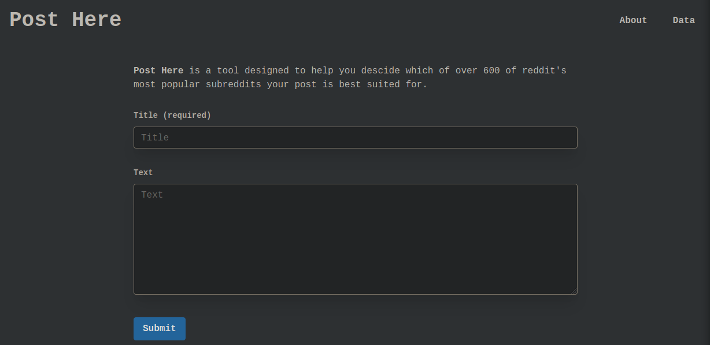
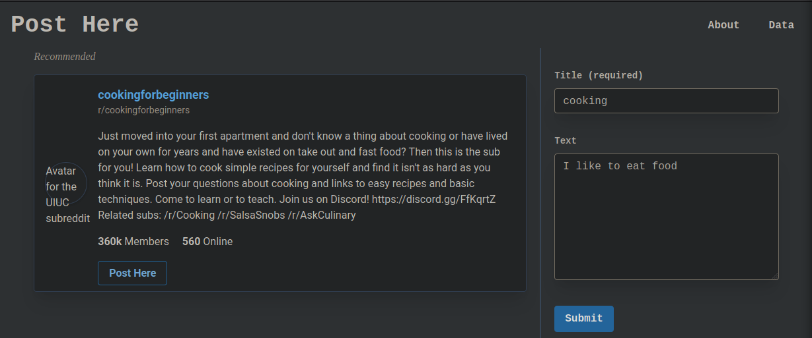
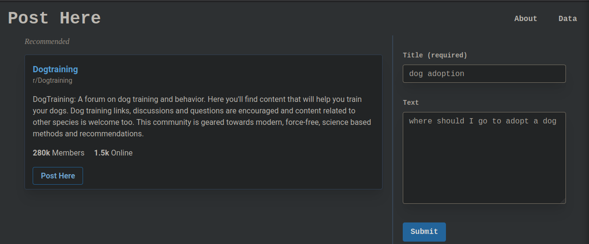

# Post Here: A Subreddit Suggestion Project

## About

Welcome! This is my fork of a Lambda School Project I created with a team of other Data Science students.

The basic idea is creating a recommendation engine for when you have an idea what you want to ask or post on reddit, but you aren't sure what subreddit to post to.

The app takes in a basic form of what you want to post, and says "Oh hey, Post Here!" with a subreddit recommendation.

A MVP of the app is available [here](https://post-here.spentaur.workers.dev/).

## Methodology
*  Scrubbed Reddit for 1000 most popular Subreddits and their first 100 or so posts using Reddit API and PRAW
*  Large dataset (mid-single digit GB) is then scrubbed and cleaned (there are NSFW things, irrelevant things, unusable things, etc) and pickled for modeling.
*  Topic Modeling pipeline created using SpaCy NLP tools.
*  Tweaked, filtered, and deployed using Azure.

## Tools Used
*  [Reddit API](https://www.reddit.com/dev/api/)
*  [PRAW](https://praw.readthedocs.io/en/latest/)
*  [SpaCy NLP](https://spacy.io/?)
*  [Azure Cloud](https://azure.microsoft.com/en-us/)

## Examples

Here are some examples of the recommendations it gives:

